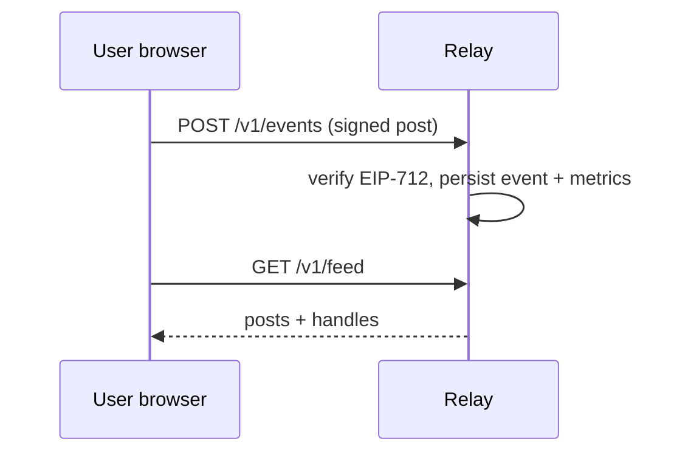
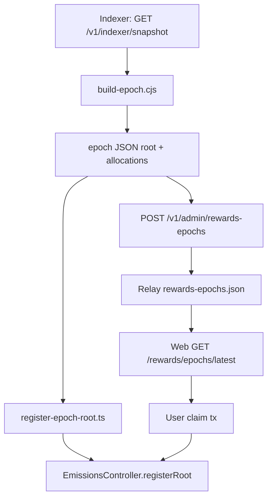

# DirecT: status, capabilities, and roadmap

**Last updated:** April 2026 (aligned with M1–M3 + social/rewards work in-repo).

This document is the **narrative companion** to [mvp-scope.md](mvp-scope.md) (milestone table), [deploy/current-environment.md](deploy/current-environment.md) (URLs, runbooks), and [protocol/README.md](protocol/README.md) (API wire formats). Read those for checklists and exact request shapes; read this for **what exists end-to-end**, **how pieces connect**, and **what to build next**.

---

## 1. What DirecT is (today)

DirecT is an MVP stack that proves:

1. **Identity and content:** Users have **DirecT profiles** (handles, passwords, optional linked signing wallets). They publish **EIP-712 signed events** to a **relay**; the web app reads feeds and per-post metrics.
2. **Settlement:** A **DIR** ERC-20 on **Base Sepolia** and an **`EmissionsController`** contract that pays creators via **Merkle `claim`** from a **pre-funded pool** (no mint-on-claim).
3. **Operator loop:** An indexer downloads a **relay snapshot**, runs an **off-chain epoch builder** (scores + Merkle tree), registers the **root on-chain**, publishes **epoch metadata** back to the relay, and users **claim from the web**.

Social layer v1 adds **asymmetric follow**, a **following-scoped feed**, and **notifications** for social activity plus **claimable rewards** hints.

### “Fully live” for paying users

All **client, relay, and contract code** for Merkle claims is in place. **Rewards** stays empty until an **operator** runs the pipeline documented in [deploy/current-environment.md — “No epoch published”](deploy/current-environment.md#why-rewards-shows-no-epoch-published-on-the-relay-yet) and [§ M3 runbook](deploy/current-environment.md#m3-epoch--claim-runbook): snapshot → **`build-epoch.cjs`** → **`registerRoot`** → **`POST /v1/admin/rewards-epochs`**. There is **no separate automated oracle** in-repo; cadence (weekly, monthly, etc.) is your ops choice.

After the first epoch is published, **paid users** (testnet DIR) are whoever appears in **`allocations`** and successfully **`claim`**s with the linked wallet.

---

## 2. Repository map (where things live)

| Area | Path | Role |
|------|------|------|
| **Contracts** | [`contracts/`](../contracts) | Hardhat: `DirecTToken`, `EmissionsController`, deploy script, Merkle tests, **epoch builder** (`scripts/build-epoch.cjs`), **register root** (`scripts/register-epoch-root.ts`). |
| **Relay** | [`relay/`](../relay) | Express API: events, feed, metrics, media, accounts, sessions, indexer snapshot, rewards epochs, follow graph, notifications. |
| **Web** | [`apps/web/`](../apps/web) | Vite + React + wagmi: auth, home feed, profile pages, settings, wallet hub, **`/claim`**, notification bell. |
| **Docs** | [`docs/`](.) | Protocol, economics, governance, security, deploy runbooks, **this file**. |

---

## 3. What we have today (by layer)

### 3.1 Smart contracts (Base Sepolia)

- **`DirecTToken`:** Capped supply; genesis mint in deploy script (**1B DIR** to deployer treasury in the reference deploy).
- **`EmissionsController`:** Owner calls **`registerRoot(bytes32)`**. Anyone with a valid proof can **`claim(root, beneficiary, amount, proof)`** as long as the contract holds enough DIR. Leaves use OpenZeppelin **standard Merkle** encoding `abi.encode(address,uint256)` with the contract’s **double `keccak256`** leaf hashing (see Hardhat tests in `contracts/test-hardhat/direct.spec.ts`).
- **Initial pool:** Deploy script transfers **10M DIR** into the controller; treasury can **`transfer`** more DIR to the controller anytime.

**Implemented off-chain:** Build epoch JSON from relay snapshot + policy, register root via Hardhat script, publish allocations to relay for the app.

### 3.2 Relay (HTTP API)

**Core content path**

- Accepts signed **`POST /v1/events`**, stores events, persists **events-state** and **metrics** (views via indexer API; reactions/comments/shares from event types).
- **`GET /v1/feed`** — global-ish post feed; **`?scope=following`** with **Bearer** session filters to handles the viewer follows.
- **`GET /v1/metrics/:eid`**, **`GET /v1/authors/:address/events`**, **`POST /v1/media`**, **`GET /v1/media/:cid`**.

**Accounts**

- Register/login, sessions, **`PATCH /v1/accounts/me`**, **`link-wallet`** with EIP-191 message.
- Profile fields include **`linkedWallets`**, optional **`payoutAddress`** (validated), **`following`** (lowercase handles, capped).

**Indexer / rewards**

- **`GET /v1/indexer/snapshot`** — gated by **`x-indexer-secret`** == **`INDEXER_SECRET`**. Returns **events**, **metrics**, and a **public account slice** (handle, wallets, payout, following) — **no password material**.
- **`POST /v1/admin/rewards-epochs`** — gated by **`x-indexer-secret`**: ingests **`PublishedRewardEpoch`** (id, root, chainId, publishedAtMs, allocations, optional registerTxHash/manifestUrl).
- **`GET /v1/rewards/epochs/latest`** — public manifest for claim UI.
- **`GET /v1/rewards/me`** — session: whether linked wallets / payout address match the latest epoch allocation list.

**Social**

- **`POST /v1/accounts/me/follow`**, **`DELETE .../follow/:handle`**, **`GET .../:handle/followers`**, **`GET .../:handle/following`**.
- **`GET /v1/accounts/me/notifications`** — social (comments, reactions, reposts) plus **follow** rows and **rewards_claimable** when the user’s wallets appear in the latest epoch.

**Persistence:** Fly volume (or local `DATA_DIR`): `relay-state.json`, `events-state.json`, `rewards-epochs.json`, media blobs, etc.

### 3.3 Web app (Netlify)

- **Auth:** Profile login; wallet connect / embedded key for **signing posts**.
- **Feed:** Home feed with unlock gate; **All / Following** toggle when session present.
- **Profiles:** **`/u/:handle`** draggable homepage; **Follow / Unfollow** and follower counts for others’ pages.
- **Settings:** Bio, images, links, accessibility toggles, **optional payout address**, link signing wallet.
- **Rewards:** **`/claim`** loads latest epoch from relay, rebuilds Merkle tree from **`allocations`**, checks root active on-chain, submits **`claim`**.
- **Wallet hub:** Balances + link to Rewards when **`VITE_EMISSIONS_ADDRESS`** is set.
- **Notifications:** Bell polls **`/notifications`**; deep links for **follow**, **rewards** (open `/claim`).

**Required env (production):** `VITE_RELAY_URL`, `VITE_CHAIN_ID` (84532), `VITE_RPC_URL`, `VITE_TOKEN_ADDRESS`, `VITE_EMISSIONS_ADDRESS`.

### 3.4 Epoch tooling (contracts/scripts)

- **`build-epoch.cjs`:** Input snapshot + policy (weights, per-user cap, pool from **`--pool-wei`** or **`--fetch-pool`**). Resolves beneficiary: **`payoutAddress`** else **`linkedWallets[0]`**; skips handles with no beneficiary; outputs **`epoch-<id>.json`**.
- **`register-epoch-root.ts`:** Owner **`registerRoot`**; writes **`registerTxHash`** into the epoch file.
- **`example-epoch-policy.json`:** Template with example Base Sepolia addresses.

---

## 4. End-to-end flows (how to think about the system)

### 4.1 Post → metrics → visibility

Engagement events (reactions, comments, shares) update **per-post metrics** keyed by parent **eid**.

### 4.2 Epoch → chain → relay → claim

**Trust note:** Users assume the relay-published **`allocations`** list is consistent with the on-chain **`root`**. They can **recompute the tree locally** and compare **`tree.root`** to **`epoch.root`** before signing **`claim`**.

### 4.3 Follow → feed → notifications

- Follow edges are **relay-authoritative** (not yet a signed protocol event). **Follow / unfollow** mutate **`AccountProfile.following`**.
- **Following feed:** server filters posts whose **`direct_handle`** is in the viewer’s following set.
- **Notifications:** recent follows for the target handle appear in **`/me/notifications`**.

---

## 5. Known limitations and honest gaps

These are **not bugs**; they are the current product/engineering boundary:

| Topic | Current state | Risk / implication |
|--------|----------------|-------------------|
| **Epoch manifest trust** | Relay stores epoch JSON; no on-chain link from root to URL/CID | Malicious or buggy relay could publish mismatched allocations vs root |
| **Follow auditability** | Internal relay records only | No portable follow graph; harder to verify across relays |
| **Scoring policy** | Single reference script (`build-epoch.cjs`) | Operators can fork policy; need governance/communication so creators understand rules |
| **Indexer secret** | Single shared secret for snapshot + admin ingest | Compromise gives export + epoch publish; rotate and scope keys for production |
| **Payout address rules** | Payout address overrides first linked wallet | Multi-wallet users must understand which address is in the tree |
| **M3 “complete” vs “proven in prod”** | Code path exists; **first real claim** is an operational milestone | Track in ops: one successful main-net or testnet claim with real users |
| **Challenge / finality** | No indexer quorum, no challenge window on roots | See [security/threat-model.md](security/threat-model.md) for long-term mitigations |

---

## 6. What’s next (recommended order)

Below is a **prioritized backlog** derived from the original phase plan and gaps above. It is **not** a commitment calendar; use it for planning and slicing PRs.

### 6.1 Hardening M3 operations (near term)

1. **Run one end-to-end epoch** in production-like env: snapshot → build → register → admin POST → user claim; capture tx hashes and update [current-environment.md](deploy/current-environment.md) if addresses change.
2. **Manifest attestation:** Publish **IPFS CID** or signed message from deployer linking **`epochId` + root + allocations hash**; store CID on relay.
3. **`GET /v1/rewards/me` by wallet (optional):** Public or API-key-gated **`?address=`** with **boolean + amount** only, if you want claims discovery without session (mind privacy).
4. **Client toast on `Claimed`:** viem **`watchContractEvent`** or receipt parsing for clearer UX (no relay change).

### 6.2 Earnings UX polish

1. **Wallet dashboard:** Show **latest epoch id**, **your allocation** (from session or address), **link to `/claim`**, **claim status** (simulation or historical reads if you index `Claimed`).
2. **Notification kind `rewards_epoch`:** Ping **all** users or followers when a **new** epoch row appears (today skews toward **claimable** if you’re in the tree).
3. **Multi-epoch history:** Relay keeps list; UI **epoch picker** for past unclaimed roots (still valid if root active and not claimed).

### 6.3 Social graph v2

1. **Signed `follow` events** in the protocol for auditability and multi-relay sync (update [protocol/README.md](protocol/README.md) and [security/threat-model.md](security/threat-model.md)).
2. **Follow suggestions, blocks, mutes** (product scope; out of current MVP).
3. **Pagination** for followers/following at scale.

### 6.4 Protocol / infrastructure

1. **Paginated or blob snapshot export** when `events-state.json` grows large (S3 + hash, or cursor API).
2. **Rate limits and abuse controls** on follow and snapshot (per IP, per account).
3. **Multiple relays** and **read replicas** (architecture doc updates).

### 6.5 Governance and tokenomics (longer horizon)

- Tie emissions caps and epoch cadence to [governance/governance.md](governance/governance.md) and [economics/tokenomics.md](economics/tokenomics.md).
- Mainnet path: audits, admin key rotation, multisig for **`registerRoot`**.

---

## 7. Document index

| Document | Use when you need… |
|----------|---------------------|
| [mvp-scope.md](mvp-scope.md) | Milestone table, M3 checklist, environment variables. |
| [deploy/first-epoch-cookbook.md](deploy/first-epoch-cookbook.md) | **First payout:** exact commands; operators vs normal users. |
| [deploy/current-environment.md](deploy/current-environment.md) | Live URLs, contract table, **M3 runbook**, Netlify env. |
| [protocol/README.md](protocol/README.md) | REST routes, snapshot + epoch ingest, wire formats. |
| [security/threat-model.md](security/threat-model.md) | Adversary model; Sybil/oracle/governance threats (mostly forward-looking). |
| [explanation/tokens-blockchain-and-content.md](explanation/tokens-blockchain-and-content.md) | Intuition for tokens vs posts. |
| [economics/tokenomics.md](economics/tokenomics.md), [governance/governance.md](governance/governance.md) | Policy and voting (not fully wired in MVP code). |
| [architecture/settlement-decision.md](architecture/settlement-decision.md) | Why L2 / settlement choices. |
| **This file** | **Holistic** “what we built / what’s next” narrative. |

---

## 8. Quick verification checklist (developers)

- **Relay:** `npm run build` in `relay/`; hit `GET /health`.
- **Contracts:** `npm test` in `contracts/` (Merkle + token tests).
- **Web:** `npm run build` in `apps/web/` with env vars set.
- **Epoch script:** From `contracts/`, run `node scripts/build-epoch.cjs` without args → usage on stderr.
- **Integration:** After admin publishes an epoch, **`GET /v1/rewards/epochs/latest`** returns **`allocations`** and **`/claim`** shows matching root (or mismatch error if data wrong).

---

*For questions that touch company-specific deployment secrets, use your internal runbooks; this repo doc stays generic except for the public testnet snapshot in `current-environment.md`.*
